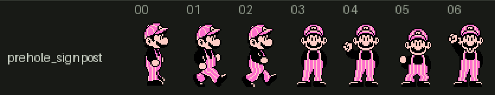
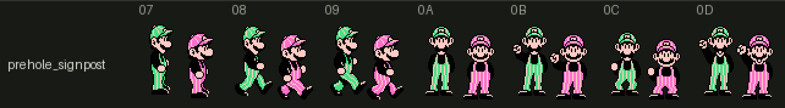
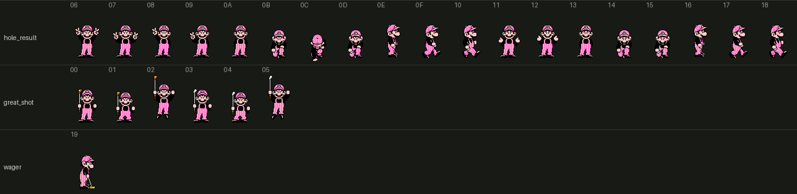
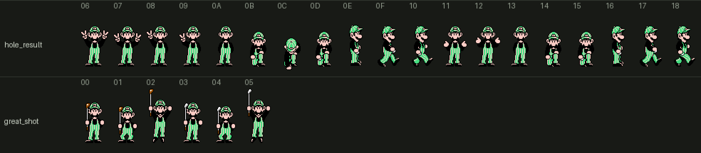
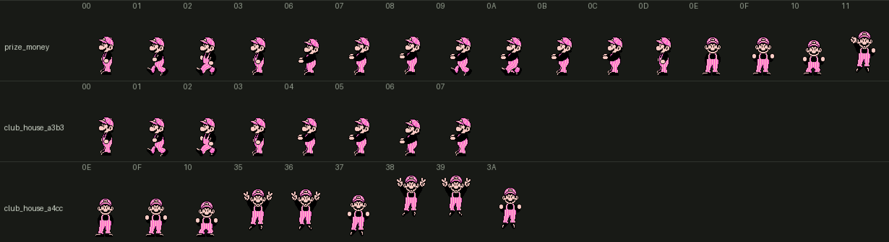

# Cutscene Golfer Sprites

> **Note**: This document was written by Claude based on investigation requested by jdharms.

Where Mario (and Luigi, as player 2) is drawn outside the shot screen: walking on beside
the pre-hole signpost, reacting to the hole just played, and the club house scenes. The
swinging golfer of `golfer_sprites.md` shares nothing with these - not the tiles, not the
metasprites, not the renderer.

`golf/core/cutscene_sprites.py` reads everything below out of the ROM;
`renders/golfers/render_cutscenes.py` draws it.

Confidence is marked per claim:

- **[C]** Confirmed - read directly out of code/data, or rendered and recognizable.
- **[D]** Derived - follows from the animation streams or from arithmetic on the data.
- **[G]** Guess - plausible reading, not verified.

Nothing here was checked in an emulator. Which screen a scene is has been read from its
code, and is marked **[G]** wherever the code doesn't say.

## Where it lives

**[C]** Every one of these is a scene object (`scene_objects.md`): bank 12 code allocates
a 9-byte record, and the object engine animates it from bank 10. The word at
`$8000 + 2 * sprite id` in bank 10 is a frame table, and its word at `2 * frame` is a
metasprite in the chunked format `RenderMetasprite` (`$FEBD`) reads. Five of bank 10's
sprite ids hold a golfer:

| Id | Frame table | Who | Frames | Shown by |
|---|---|---|---|---|
| `$01` | `$811D` | Mario | `$00`-`$06` | the pre-hole signpost, one player |
| `$01` | | Mario and Luigi | `$07`-`$0D` | the pre-hole signpost, two players |
| `$02` | `$8994` | Mario | `$00`-`$1A` | the hole result, the great shot scene, the wager scene |
| `$03` | `$923B` | Luigi | `$00`-`$18` | the same, as player 2 |
| `$05` | `$A2B1` | Mario | `$00`-`$11`, `$35`-`$3A` | Prize Money and two more club house scenes |

**[C]** Sprite `$01`'s frames `$0E` and `$0F` are the signpost's own pieces, and sprite
`$05`'s other frames are the Prize Money stacks (`$12`-`$31`), a face (`$33`, `$34`) and
two small props (`$3B`, `$3C`). Sprite `$04` is the wager scene's flags and pointer.
Sprites `$07`-`$0C` are the course intro portraits (`course_intro_scene.md`).

**[D]** In the two-player signpost frames both brothers are one metasprite, Luigi drawn
with sprite palette 1 and Mario with palette 0, so replacing Mario there means rewriting
half of each of seven metasprites.

## Scenes

Each scene loads its own sprite CHR to `$0000` and its own 32-byte palette set. All
addresses are bank 12.

| Scene | CHR loads at | CHR tables | Palette | Sprite, frames |
|---|---|---|---|---|
| Pre-hole signpost (`LC_AC01_PlaceGolferStandee`) | `$AC17` | bank 7 `$8000` | `$ADA4` | `$01`: `$00`-`$06`, or `$07`-`$0D` with two players |
| Hole result, stroke play | `$B14B` / `$B178` | bank 6 `$8000` / `$8AB2` | `$B680` | `$02` / `$03`: `$06`-`$18` |
| Great shot | `$B831` / `$B83A` | bank 6 `$8000` / `$8AB2` | `$BDB2` | `$02` / `$03`: `$00`-`$05` |
| Wager | `$B903` | bank 6 `$8000`, bank 0 `$B2E2` | `$BDEA` | `$02`: `$19` |
| Prize Money | `$8F85` | bank 6 `$8000` | `$9125` | `$05`: `$00`-`$03`, `$06`-`$11` |
| Club house, `$A3B3` | `$A3B3` | bank 6 `$8000`, bank 7 `$8A45` | `$A469` | `$05`: `$00`-`$07` |
| Club house, `$A4CC` | `$A4CC` | bank 6 `$8000` | `$A5F7` | `$05`: `$0E`-`$10`, `$35`-`$3A` |

### The hole result

**[C]** The call chain, once a player holes out:

1. Bank 13 `$8D8F` far-calls bank 11 `$BEE5`, which adds the hole's strokes and putts to
   the player's totals. For `GolfGameMode` 4 and up it branches to `$BF41` instead, which
   picks the hole's winner as `CurrentPlayerIndex`.
2. Both reach `$BF7E`, which far-calls bank 12 `$B094`, the scene.
3. `$B094` loads the background, then for `GolfGameMode` 0-2 (`$B123`) loads Mario's CHR
   for player 1 or Luigi's for player 2, and draws the name, totals and result text.
4. `$B2F3` classifies the hole into `$070B`: 0 when the hole took one stroke, otherwise
   strokes - par + 4, capped at 8.
5. `$B35B` turns the class into an index into `ObjectRecordPtrTableCB562` (`+10` for
   player 2) and allocates that one record. The record is the whole choice: all five sit
   at the same position with the same sprite, and differ only in their two streams.

| `$070B` | Text (`HoleResultStringPtrTable`) | Music (`HoleResultMusicTable`) | Record | Animation | Motion |
|---|---|---|---|---|---|
| 0 | HOLE IN ONE | `$14` | 0 | `$88B6` | `$8928` |
| 1, 2 | ALBATROSS, EAGLE | `$14` | 1 | `$88BB` | `$8944` |
| 3 | BIRDIE | `$14` | 2 | `$88DC` | `$8960` |
| 4 | PAR | `$15` | 3 | `$88F3` | `$8963` |
| 5, 6, 7 | BOGEY, DOUBLE BOGEY, TRIPLE BOGEY | `$16` | 4 | `$8908` | `$896C` |
| 8 | none | `$16` | 4 | | |

**[C]** The animation streams. A step is two bytes, how many video frames to hold a pose
and which pose, so the ROM's `2F 0A` is written "stand 47" below: pose `$0A` for 47 frames,
about 0.8 seconds. A run of numbers after an alternating pair is the hold of each step in
turn. Records 0-3 all end in the same tail, and jump into it at different points:

| Record | Own steps | Then |
|---|---|---|
| 0 | stand `$0A` 16 | the pickup |
| 1 | stand 47; both hands up in a V, `$06`/`$07` alternating, 26 8 8 8 32 | the pickup |
| 2 | stand 47; one hand up, `$08`/`$09` alternating, 26 8 8 8 32; stand 24, crouch `$0B` 17, reach `$0C` 24, rise `$0D` 17 | the walk |
| 3 | stand 47; one hand up `$08` held 40; stand 24, crouch 17, reach 24, rise 17 | the walk |
| 4 | stand 47; `$13` 15, `$11` 10, shrug `$12` 32, `$13` 31, crouch `$14` 20, reach `$0C` 32, rise `$15` 20, `$13` 6 | its own walk: `$16 $17 $16 $18`, 13 each, looping |

The pickup (`$88C9`) is stand 31, crouch 20, reach 32, rise 20; the walk (`$88CF`) is
stand 6, then `$0E $0F $0E $10`, 13 each, looping. So every result takes the ball out of
the cup; the good ones celebrate first, and the bad one swaps in the downcast standing,
crouching and walking poses.

**[C]** The motion stream is what ends the scene. Each holds the object still for as long
as its animation's poses last, then moves it right at x speed `$76` a frame until its x
(`$7811`) passes a threshold, and stores 1 to `SceneExitFlag` (`$0682`), which the scene's
loop at `$B0F6` checks. A or B from the player's controller ends it early (`$B105`).

**[D]** A hole in one gets no celebration here because the great shot scene has already
played it (below): bank 13 `$835C` runs before this chain.

**[C]** For `GolfGameMode` 4-7 the hole result takes another branch (`$B1C8`) that loads
no golfer CHR of its own. The records at `$B7BE` (reached only through
`MaybeObjectRecordPairTable`) reuse the same streams and are presumably its golfers
**[G]**.

**[C]** The great shot scene has three entry points, each loading its own background and
music track before joining at `$B81B`:

| Entry | Called from | When |
|---|---|---|
| `$B7D9` | bank 13 `$835C` | the hole is complete and `CurrentHoleStrokes` is 1: a hole in one |
| `$B7F0` | bank 2 `$AE0A` | `HoleMatchStatus` 1, `BallLie` 0, `ShotDistancePixels` at least `$82`, and a roll against `RngState` that longer shots pass more often |
| `$B807` | bank 2 `$AE5A` | `HoleMatchStatus` 2, `BallLie` 6, the distance at `$8C`/`$8D` under 5, and a roll that closer shots pass more often |

**[G]** The two bank 2 callers read like the long drive and near-pin holes
(`RandomPar5HoleNumber`, `RandomPar3HoleNumber`).

**[C]** Its record comes from `ObjectRecordPtrTableCB871` by the club just used: frames
`$00`-`$02` hold a wood up for clubs 0-3, `$03`-`$05` an iron for the rest. The identical
streams at `$B740` and `$B77F` have no allocator found.

**[C]** Frame `$19` of sprite `$02` is Mario over a putter, and draws tiles `$A0` upward
from the wager scene's second CHR table. Frame `$1A` is the same pose one step on, and no
stream found shows it.

**[C]** The `$A4CC` scene is a jumping celebration with seven objects. Its routine starts
at `$A4A4` and is far-called from bank 9 `$B1A0`, in code that has just looked a prize up
in `MaybePrizeByPlacingTable` by game mode, `PlayerRank` and a placing class. **[G]** So it
follows a tournament finish, not a shot.

**[G]** What the club house scene at `$A3B3` is. It starts text script `$B8DD` (`$B93C`
when `GolfGameMode` has bit 2 set) and walks Mario in; its one caller found is `$A376`.

## Tiles

**[C]** Three CHR tables hold every Mario pose:

| Table | PPU | Compressed | Serves |
|---|---|---|---|
| bank 6 `$8000` | `$0000`-`$0F7F` (248 tiles) | 2,738 B | sprites `$02` and `$05` |
| bank 7 `$8000` | `$0000`-`$0B7F` (184 tiles) | 2,239 B | sprite `$01`, both brothers |
| bank 0 `$B2E2` | `$0A00`-`$0DEF` | 865 B | the wager scene, over the first table |

Luigi's counterpart of the first is bank 6 `$8AB2` (`$0000`-`$0B9F`, 2,135 B).

**[D]** Tile use, counting each distinct tile once:

| Set | Frames | Tiles | Range | Sprites a frame | Peak on a scanline | Metasprite bytes |
|---|---|---|---|---|---|---|
| Signpost, Mario | 7 | 87 | `$16`-`$B7` | 18-25 | 4 | 496 (`$813D`-`$832C`) |
| Signpost, both | 7 | 184 | `$00`-`$B7` | 38-52 | 8 | 1,323 (`$832D`-`$8857`) |
| Sprite `$02`, Mario | 26 | 171 | `$00`-`$D3` | 19-34 | 7 | 2,091 (`$89CA`-`$91F4`) |
| Sprite `$03`, Luigi | 25 | 171 | `$00`-`$AE` | 20-36 | 6 | 2,271 (`$926F`-`$9B4D`) |
| Sprite `$05`, Mario | 24 | 130 | `$00`-`$E0` | 18-46 | 8 | 1,927 (`$A32B`-`$ADFD`) |

**[D]** Sprites `$02` and `$05` draw Mario from the same table and share 95 tiles; together
his poses use 206 of its 248. The rest of sprite `$05` (the money, the face, the props)
uses 43 more, and six of its tiles are ones a Mario pose also draws, so the table can't be
cut cleanly into "Mario" and "everything else".

## Palette

**[C]** Sprite palette 0 is `25 0F 36` in every one of these scenes - the shot screen's
Mario (`golfer_sprites.md`) - and Luigi is palette 1, `2B 0F 36`. Only color 0 differs
between scenes, with the backdrop.

**[C]** Unlike the swing's renderer, this format carries an attribute per sprite (or per
chunk), so a pose can mix palettes and flip tiles. Mario's poses use palette 0 with
horizontal flips throughout; the great shot frames add palettes 2 and 3 for the club, and frame
`$19` palette 3 for the putter.

## Renders

One row per scene, drawn with that scene's CHR and palette, frame numbers above.

## What an export and import would need

`golf-golfer-export` covers the swing and putt only. Extending it here is not a matter of
more frames:

- **Tiles are shared across poses and mirrored.** The swing's frames are laid out on an
  8x8 grid with one palette. These reuse tiles between frames, flip them, and place them
  off-grid, so an importer has to cut a drawn frame into tiles, deduplicate (including
  flips) and write new metasprites, rather than repaint tiles in place.
- **One table, two sprites, and other art in it.** A new Mario for sprites `$02` and `$05`
  has to fit bank 6 `$8000` alongside the money and props, in 248 tiles, and recompress
  into its 2,738 bytes or move.
- **The signpost table holds Luigi too**, and the two-player metasprites hold both.
- **Metasprites grow and shrink.** Each set's data is a contiguous run in bank 10 with the
  next sprite's frame table right behind it, so a larger set has to move and its frame
  table be repointed.
- **Three colors, as for the swing**: every scene gives Mario the same palette.

## Open questions

- Which screen the club house scene at `$A3B3` is.
- The golfers of the hole result for `GolfGameMode` 4-7.
- Whether anything shows frame `$1A` of sprite `$02`.
- Mario's poses that are not scene objects: the course intro portraits and the Prize Money
  background animation (`prize_money.md`, the 6x7 tile block) are drawn other ways and are
  not covered here.
