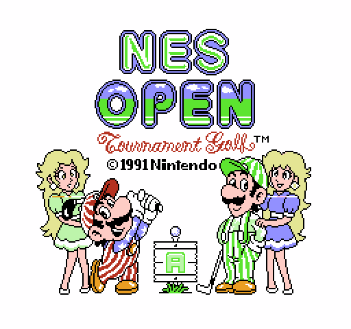

# Title Screen

> **Note**: This document was written by Claude based on investigation requested by jdharms.

The title screen is bank 12 `$8000`: the NES OPEN logo, Mario and Luigi with two
caddies, and a small signpost between them showing the player's rank. It is one
background, 56 sprites redrawn every frame, and two mid-frame pattern-table switches.
Pressing A or Start leaves for the menu chain (`docs/menu_system.md`); holding B, Select
and Right for about two seconds plays the credits.

`renders/title_screen/render_title.py` rebuilds it from the ROM, once per rank:

## Setup - `$8000`

1. `LCDB3` blanks the screen and `NametableDescriptorC8269` writes 32 palette bytes to
   `$3F00`.
2. `LC_80B7` clears the object slots, sets a clip window (`ObjectClipWindowC8264`, through
   `LF881`), maps object bank 10 (`$3A`), clears `SceneExitFlag` and the input byte, and
   sets `$0686` to 0 so fades are computed rather than read from a table.
3. Three graphics tables from bank 5:

   | Table | Writes | Contents |
   |---|---|---|
   | `$8000` | CHR `$0000`-`$0FFF` | sprite tiles, and the background tiles above the split |
   | `TitleScreenBackgroundChrTable` (`$8A06`) | CHR `$1000`-`$1FFF` | background tiles below the split, and the sprite tiles there |
   | `$9576` | `$2000`-`$23FF` | the nametable and attributes |

4. `Load32BytesToBuffer` copies `PaletteDataC8299` to `PaletteBuffer`.
5. **The rank letter.** If SRAM `$6003` (the player rank) is non-zero, `$8041` takes its
   entry from `TitleSignpostRankLetterPtrTable` and writes 64 bytes - a 2x2-tile letter -
   over tiles `$CA`-`$CD` at CHR `$1CA0`. Rank 0 skips the write and keeps the letter
   already in `TitleScreenBackgroundChrTable` there:

   | `$6003` | Rank | Letter |
   |---|---|---|
   | 0 | Beginner | B |
   | 1 | Amateur | A |
   | 2 | Semi-Pro | SP |
   | 3 | Professional | P |

6. Music track `$01` is requested unless it is already playing, so returning from the
   menus doesn't restart it.
7. `PpuCtrl_Cache` gets bits 3 and 4 cleared - both pattern tables at `$0000` for the top
   of the frame - and `LC_8158` fades in: five steps of `PaletteFadeStepTable`
   (`$40` down to `$00` subtracted from each color), five frames each.

## Each frame - `LC_8081_TitleScreenLoop`

The loop copies the new-press byte to `MenuInputByte`, calls `TitleScreenUpdate`, steps the
RNG (so the seed depends on how long the title is up), runs `HideUnusedSprites` (`$FF7E`),
and repeats until `SceneExitFlag` is set.

`TitleScreenUpdate` (`$80EC`):

1. Copies `TitleScreenSpriteData` - 224 bytes, all 56 sprites - into OAM. Nothing moves:
   the same data every frame.
2. Waits for vblank, then for the sprite-0 hit flag to clear and set again. Sprite 0 sits
   at (192, 127) and first overlaps the background on line 135.
3. After a short delay, sets PPUCTRL bit 4: the **background** fetches from `$1000` for the
   rest of the frame.
4. After a 160-iteration delay loop (about 800 CPU cycles, roughly seven lines), sets bit 3
   as well: **sprites** fetch from `$1000` below that.

So the logo and the upper half of the characters use the `$0000` tiles, and the lower half
- legs, the signpost and its letter - the `$1000` tiles; the 512 tiles of both tables
together are what one screen needs. The renderer switches on whole lines at 135 and 142;
the real switch points fall partway through those lines.

Then it reads the controller:

- **A or Start** (new press, `$80 | $10`) sets `SceneExitFlag`: the menu chain, through
  `LC_8459`.
- **B + Select + Right held** (`Controller_Current == $61`) counts `$070C` up; at 128
  frames it sets `CourseIntroPhaseStep` to 1 and `SceneExitFlag`. Any other input resets
  the count.

### `HideUnusedSprites`

The routine most scene loops end with: it sets Y to `$F0` (off screen) for every OAM
buffer slot from `OamWriteOffset` (`$4A`) to the end, hiding whatever the frame didn't
draw. `TitleScreenUpdate` sets `OamWriteOffset` to 0 and writes its 56 sprites without
advancing it, so here the routine blanks all 64 slots. That costs nothing: the NMI has
already sent the buffer to the PPU (`STA $4014` at `$D2D2`) at the start of vblank, and
the next frame's update rewrites slots 0-55 around line 145, long before the next NMI. Its
lasting effect is on slots 56-63, which the title never writes - it keeps sprites left
over from the menus from showing.

## Leaving

`LC_8208` fades the palette out, `LCDB3` blanks the screen, and PPUCTRL is set for a
`$1000` background. If `CourseIntroPhaseStep` is still 0 the game goes on to the menus
(`LC_8459`); otherwise `$A7D3` runs and the title restarts after it.

## The credits combo

`$A7D3` is the second entry to the ending scene. The normal entry, `$A7BF`, is reached from
bank 9 `$B0D7` when the player reaches a top rank: it clears the phase, requests music
`$09`, and plays the portrait scene with the script "I knew you could do it! Now you are
one of the top-ranked players!" before moving on to the closing part at `$A940` (bank 7
and 8 graphics, palette `PaletteDataCAA01`, ten objects from `ObjectRecordsCAB2D`) and the
script "Thank you..." at bank 11 `$BBAF`.

The title combo enters at `$A7D3` with `CourseIntroPhaseStep` set, which sends it straight
to `$A940` and, at `$A965`, to the credits script at bank 11 `$BC7D` (PRODUCER, DIRECTOR,
DESIGN, PROGRAM ...) instead - the credits without having earned the ending.
